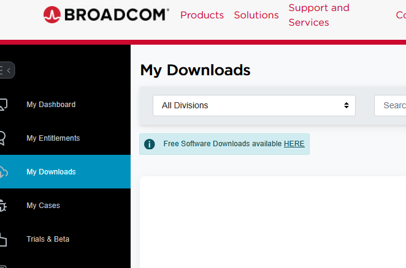
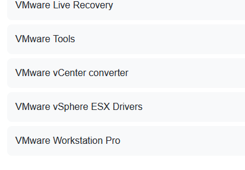
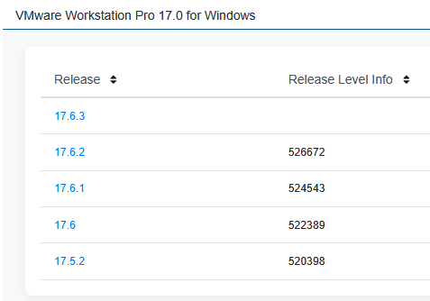
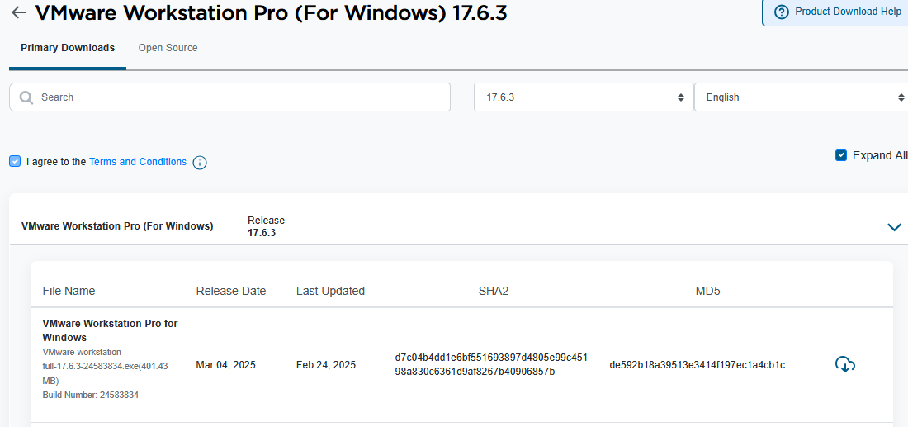
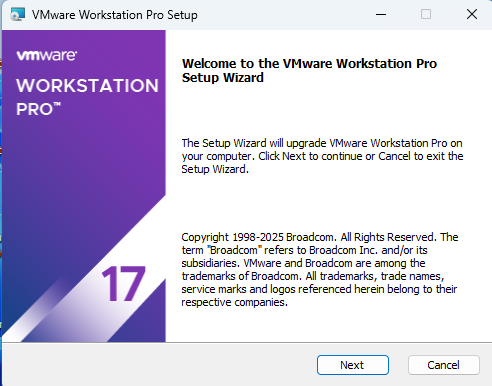
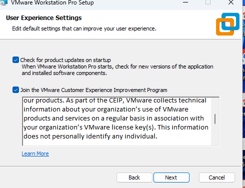
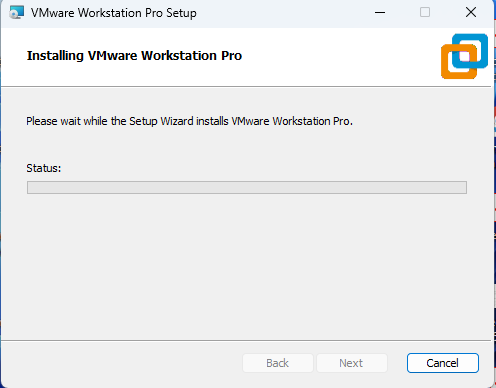
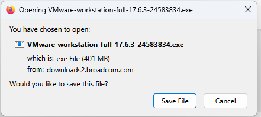

# 🖥️ VMware Workstation Pro 17.6.3 Installation Guide

This guide provides a step-by-step walkthrough for downloading, installing, and launching VMware Workstation Pro 17.6.3 on Windows.

---

## 🌐 Step 1: Download VMware Workstation

1. Go to the official VMware website:  
   👉 [https://www.vmware.com/products/workstation-pro.html](https://www.vmware.com/products/workstation-pro.html)

2. Alternatively, you can also download from the Broadcom support portal:  
   👉 [https://support.broadcom.com/group/ecx/downloads](https://support.broadcom.com/group/ecx/downloads)

   > I downloaded VMware Workstation Pro 17.6.3 from the official Broadcom support portal after registering an account. After logging in, I navigated to **Downloads > Free Software Downloads**, selected the latest version (17.6.3) from the dropdown, and proceeded to download. Before the download started, I was prompted to enter my address, city, and postal code. VMware Tools was also available for installation along with the main setup file.
   
### 📸 P1: Broadcom Dashboard
   
 

### 📸 P2: VMware

 

### 📸 P3: VMware (Choose the Version)
 
 

### 📸 P4:

Click on **Download Now** under *Workstation 17 Pro for Windows* to start downloading the installer.

     

---

## ⚙️ Step 2: Run the Installer

1. Locate the downloaded `.exe` file (e.g., `VMware-workstation-full-17.6.3.exe`).
2. Right-click and select **Run as administrator**.
3. If prompted by Windows security, click **Yes** or **Allow**.

---

## 📦 Step 3: Installation Wizard

 

- Click **Next**

 

>Accept the license agreement  
>Leave default settings or customize as per your need  
>Click **Install**

- Installation in Progress

     
   
---

## ✅ Step 4: Complete Installation

1. Click **Finish** after installation  
2. Restart your computer if prompted

   >Finish Setup

---

## 🚀 Step 5: Launch VMware Workstation

- Open VMware from the Start menu or Desktop icon.
- Help-About vmware workstation-Version info
  
   

---

## 🛠️ Step 6: Tips for Smooth Setup

- Use **NAT** or **Bridged** networking depending on your use
- Assign at least **4 GB RAM** and **2 CPU cores** to your VM for better performance
- Keep a **backup snapshot** before making big changes

---

